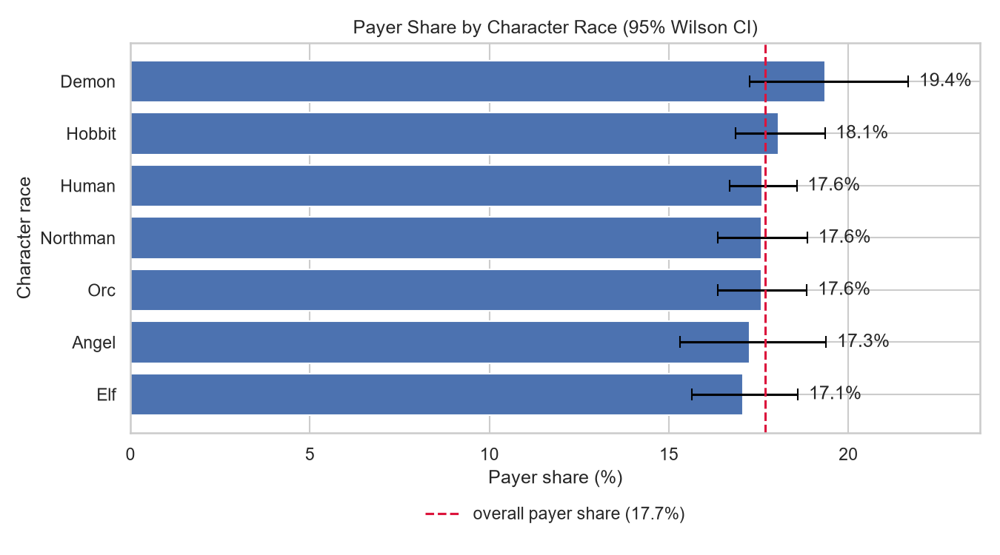
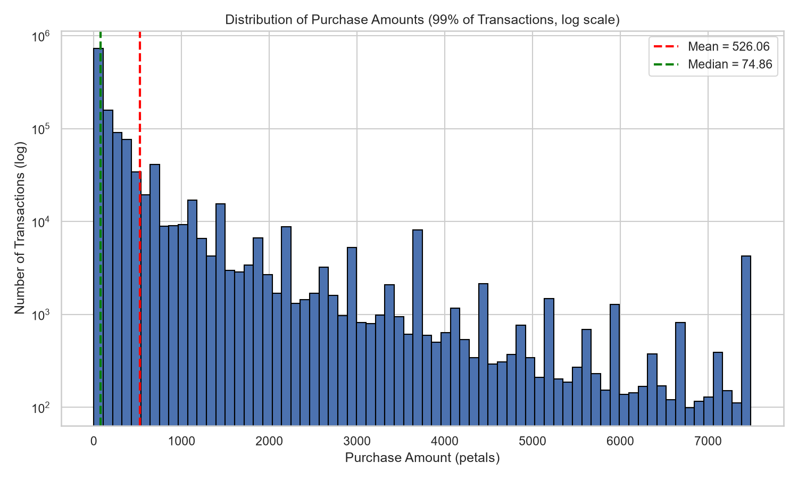
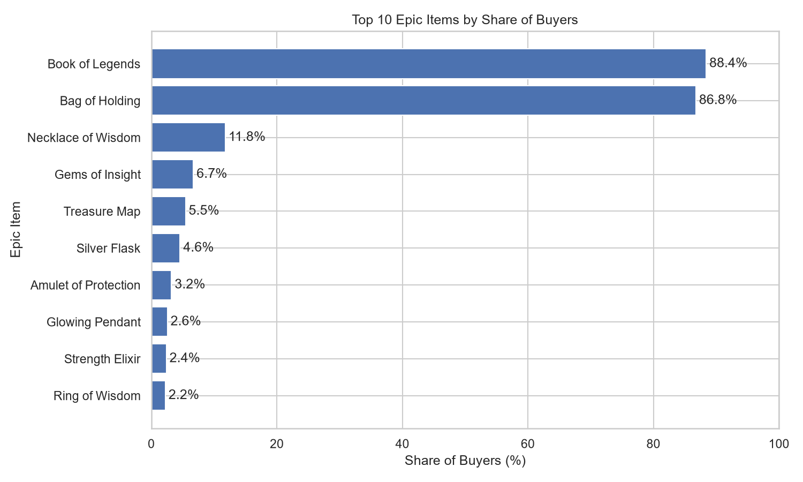
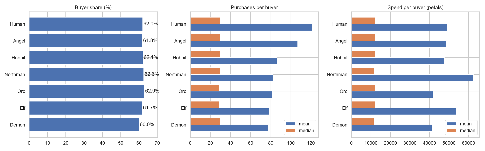
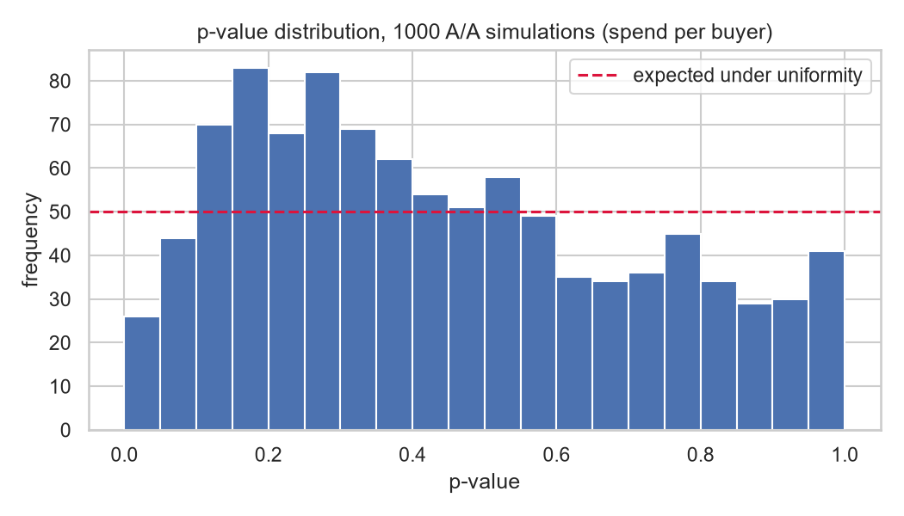
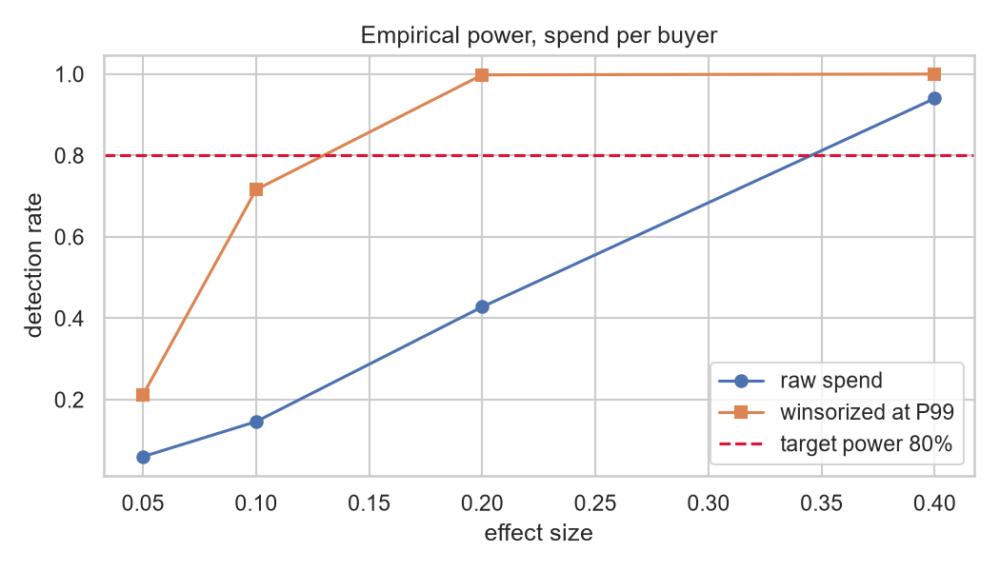

# Gaming Product Analytics - Secrets of Darkwood

SQL and Python analysis of premium-currency monetization and in-game purchasing behavior
in the MMORPG *Secrets of Darkwood*.

**Data:** 22,214 registered players, 1,307,678 purchase transactions (PostgreSQL).
**Stack:** PostgreSQL, DBeaver, Python (pandas, matplotlib, seaborn, SciPy), Jupyter.

> **A note on units.** The game runs on a premium currency, *paradise petals*, which players
> either earn through quests or buy for real money. The `amount` field records spend **in
> petals, not in money** - so sums over it measure in-game turnover, not revenue. The only
> revenue-related field in the schema is the binary `payer` flag. Buyers and payers are
> distinct populations and are treated as such throughout.

---

## Key Findings

- **17.7% of registered players convert to real-money payers** (3,929 of 22,214). This is the
  single revenue-bearing metric available in the data.
- **Race does not affect real-money conversion.** Payer share ranges from 17.1% to 19.4%
  across races, but a chi-squared test of independence returns **χ² = 3.64, df = 6, p = 0.72** -
  the spread is fully consistent with noise. The apparent Demon advantage disappears under
  testing (p = 0.12 against all other races); it is an artifact of the smallest race group
  (1,229 players) having the widest confidence interval. Race is not a usable targeting axis
  for monetization.
- **In-game spend is extremely heavy-tailed.** Excluding zero-cost events, mean purchase is
  526.06 against a median of 74.86, standard deviation 2,518 — a coefficient of variation of
  4.8 per transaction, rising to 6.03 when aggregated per buyer. The top 0.1% of transactions
  account for 9.6% of total turnover. Any comparison of means on this metric is statistically fragile.
- **Demand is concentrated in two items.** *Book of Legends* accounts for 76.9% of all paid
  transactions and was bought by 88.4% of buyers; *Bag of Holding* accounts for 20.8% and
  86.8%. The remaining 143 items form a negligible long tail.
- **Data quality:** 907 zero-cost transactions (0.069% of all events) were identified and
  excluded from all downstream analysis.
- **Races are balanced.** Mean purchases per buyer appear to differ by 55.9% across races, but
  medians are identical at 29-30 and a Kruskal-Wallis test returns p = 0.95. The apparent
  spread is driven by a single Human account with 88,304 purchases. The developers' parity
  assumption holds; no rebalancing is indicated.
- **The default significance test fails on this metric.** Across 1,000 A/A simulations, Welch's
  t-test on raw spend per buyer produced a 2.6% false positive rate against a nominal 5%
  (KS test for uniformity, p < 0.0001) — conservative rather than permissive, because extreme
  accounts inflate the sample variance. Winsorizing at P99 restores calibration (FPR 5.6%) and
  cuts the MDE from 28.8% to 10.6%.  

---

## Analysis

### 1. Real-money conversion

Overall payer share, and payer share by race, tested for significance rather than ranked by
eye. The task asks whether race influences conversion; the answer is no, and the ranking of
seven point estimates is not evidence to the contrary.



### 2. In-game purchasing

Descriptive statistics of purchase amounts, distribution shape, zero-cost transaction
detection, and epic item popularity ranked by share of buyers.




### 3. Race balance (ad hoc)

Requested by the analytics team to test a **game design** hypothesis: that some races are
harder to play and therefore require more epic item purchases to progress. The design goal is
parity - no race should be markedly easier or harder than another.

Per race: registered players, buyers and buyer share, payer share among buyers, purchases per
buyer, average purchase amount, and total spend per buyer.



*Caveat carried into the conclusions:* no differences were found, but it is worth noting that
race is chosen by the player, not assigned at random. Had a difference appeared, it could have
reflected self-selection by player type rather than any property of the race itself — a causal
claim about game difficulty would require randomized assignment, which is not available here.

### 4. Metric validation and experiment design

Sections 1–3 describe what the product currently does. This section asks a different question:
**which effects are detectable on this audience at all**, and therefore which of the marketing
team's proposed changes are worth testing.

No experiment was run in the game. Historical data is used as a testbed - players are split at
random with no treatment applied (A/A simulation, 1,000 iterations), so a correctly calibrated
test must reject the null in ~5% of runs with uniformly distributed p-values. MDE is then
derived analytically and power estimated by injecting a synthetic effect.

Two candidate metrics are compared:

| Metric | Type | Calibrated? | MDE | Verdict |
|---|---|---|---|---|
| Real-money conversion | binary, n = 11,107/group | yes | **1.43 pp (8.1% rel.)** | testable |
| Spend per buyer, raw | continuous, CV 6.03 | **no** (FPR 2.6%) | 28.8% | unusable |
| Spend per buyer, winsorized P99 | continuous, CV 2.22 | yes (FPR 5.6%) | 10.6% | usable as decision metric |
| Spend per buyer, log1p | continuous, CV 0.22 | yes (FPR 5.2%) | 1.0% | changes the estimand |

Contrary to the usual expectation that the CLT rescues heavy-tailed metrics at n ≈ 10⁴,
Welch's t-test **failed** here: a 2.6% observed false positive rate against a nominal 5%, with
significantly non-uniform p-values. A practitioner running this test unchecked would have
concluded, wrongly, that a true effect was absent.

**Practical implication.** The marketing team's stated goal - driving real-money conversion
through advertising - is testable: an 8% relative lift is detectable on the full player base.
In-game spend per buyer is testable only after variance reduction — the raw metric is both
miscalibrated and underpowered, while winsorizing at P99 brings the MDE down to 10.6%. Testing
anything at the level of a single race remains hopeless (MDE ≈ 34% relative for the smallest race).




---

## Recommendations

| Finding | Action | Metric |
|---|---|---|
| Conversion is race-independent (p = 0.72) | Do not segment monetization campaigns by race - no evidence supports it | — |
| 82.3% of players never pay | Focus acquisition-to-payment funnel work on the whole base; conversion is the bottleneck | Payer share |
| Two items dominate demand | Test bundling long-tail items with the two dominant ones rather than discounting them standalone | Items per buyer |
| Spend is heavy-tailed at both grains (CV 4.8 per transaction, 6.03 per buyer) | Report median and P90 alongside the mean; never test on raw mean spend — winsorize or use a rank-based test | — |
| Conversion MDE = 1.43 pp | Run advertising experiments on the full base, on conversion, not on in-game spend | Payer share |

---

## Repository Structure

```text
gaming-product-analytics/
├── README.md
├── analysis/
│   ├── gaming_product_analysis.ipynb
│   ├── overall_monetization.csv
│   ├── monetization_by_race.csv
│   ├── purchase_statistics.csv
│   ├── purchase_amounts.csv
│   ├── zero_cost_transactions.csv
│   ├── popular_items.csv
│   ├── race_activity.csv
│   └── player_spend.csv
├── images/
│   ├── payer_share_by_race.png
│   ├── purchase_distribution.png
│   ├── top_epic_items.png
│   ├── race_activity.png
│   ├── aa_pvalue_distribution.png
│   └── power_curve.png
└── sql/
    ├── 01_monetization_analysis.sql
    ├── 02_in_game_purchases.sql
    ├── 03_race_activity_analysis.sql
    └── 04_player_level_spend.sql
```

Full analysis and interpretation: `analysis/gaming_product_analysis.ipynb`

Source tables: `fantasy.users`, `fantasy.events`, `fantasy.items`, `fantasy.race`